# Sistema predictivo e interpretable para recomendacion de intervenciones academicas basadas en GPA

**Autores:** Edson Manuel Zepeda Chávez, Francisco Ricardo Moreno Sánchez, Alan Emir Martínez Espinosa<br>
**Correos:** rmcedson09@gmail.com, fmorenosanchez39@gmail.com, maresesp012@gmail.com<br>
**Afiliaciones:** Edson Manuel Zepeda Chávez: Samsung Innovation Campus 2025-2026, Universidad de Colima, Bachillerato 16; Francisco Ricardo Moreno Sánchez: Samsung Innovation Campus 2025-2026, CONALEP Plantel 262; Alan Emir Martínez Espinosa: Samsung Innovation Campus 2025-2026, CONALEP Plantel 262<br>
**Repositorio:** https://github.com/Edson-Zepeda/proyecto-gpa<br>
**Formato principal:** LaTeX IEEE/IMRaD en `Paper_Proyecto_GPA.tex`

> Logos opcionales: para incluir logos en la version PDF, coloca `logo_udem.png` y/o `logo_sic.png` dentro de `paper/figures/`. El archivo LaTeX ya esta preparado para mostrarlos si existen.

## Resumen

Este articulo presenta un sistema predictivo e interpretable para estimar el rendimiento academico de estudiantes y transformar la salida del modelo en recomendaciones accionables de intervencion temprana. El estudio utiliza un dataset tabular de 2,392 estudiantes y 15 variables, incluyendo edad, tiempo semanal de estudio, ausencias, tutorias, apoyo parental, actividades extracurriculares y GPA. El enfoque combina regresion para estimar GPA y clasificacion calibrada para estimar la probabilidad de alcanzar buen rendimiento, definido como `GPA >= 2.5`.

El mejor modelo de regresion fue `LinearRegression`, con `RMSE = 0.1963` y `R2 = 0.9534` en prueba. `XGBoost` produjo predicciones muy similares a las del modelo lineal (`correlacion = 0.9957`), pero mostro mayor brecha entre entrenamiento y prueba, por lo que no generalizo mejor. Al quitar `Absences`, el RMSE del modelo lineal subio de `0.1963` a `0.8692`, confirmando que las ausencias son el factor dominante. Finalmente, se implemento un motor de recomendaciones que simula intervenciones, excluye variables sensibles o no accionables y prioriza acciones con mayor impacto estimado en GPA y probabilidad de buen rendimiento.

**Palabras clave:** rendimiento academico, GPA, aprendizaje automatico, Educational Data Mining, XGBoost, recomendaciones academicas, alerta temprana, interpretabilidad.

## 1. Introduccion

La prediccion temprana del rendimiento academico puede apoyar a tutores, docentes y coordinadores en la identificacion de estudiantes con riesgo. Sin embargo, una prediccion aislada no basta para uso escolar: la pregunta practica no es solo cuanto GPA se espera, sino que acciones pueden elevar la probabilidad de buen rendimiento.

Este proyecto construye una ruta completa: predecir GPA, comparar modelos, analizar por que `XGBoost` no supera al modelo lineal, medir el impacto de `Absences`, entrenar un clasificador de buen rendimiento y generar recomendaciones accionables. La historia central del paper es pasar de un modelo predictivo a una herramienta de apoyo para intervenciones academicas supervisadas.

## 2. Datos

El archivo local `student_performance.csv` contiene:

- `2392` registros
- `15` columnas
- `0` valores faltantes
- `GPA` observado entre `0.0` y `4.0`
- `GPA` promedio de `1.9062`
- `706` estudiantes con `GPA >= 2.5`
- `1686` estudiantes con `GPA < 2.5`

La fuente probable del dataset es Kaggle, **Students Performance Dataset**, de Rabie El Kharoua. Antes de una publicacion formal debe confirmarse la procedencia exacta del archivo local.

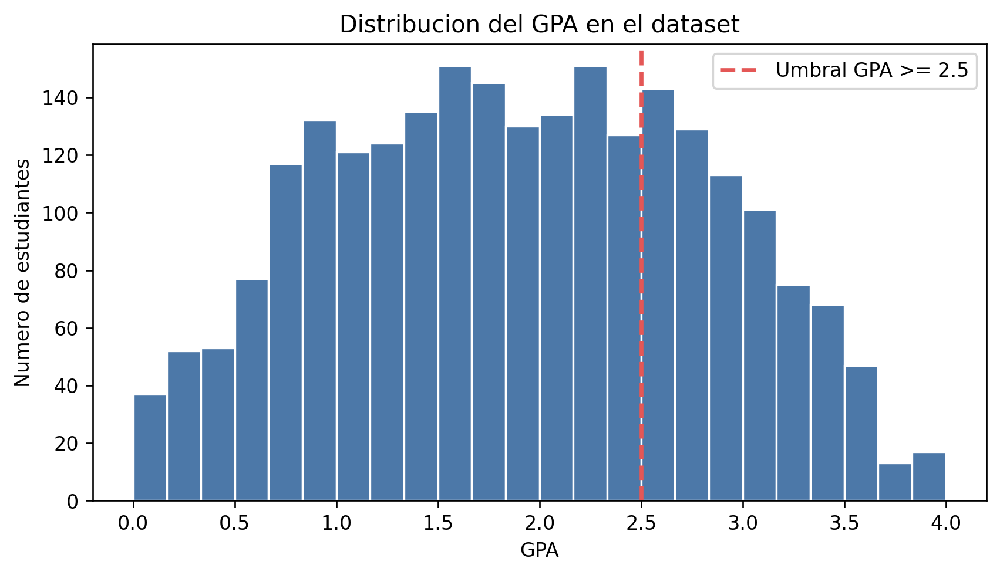

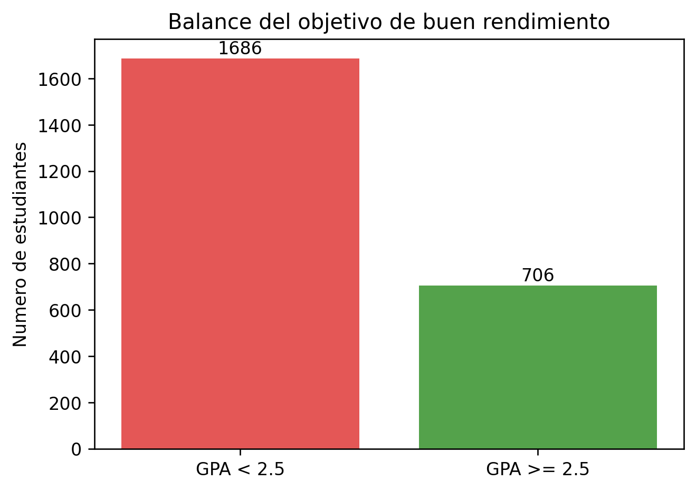

## 3. Metodologia

Para regresion se uso `GPA` como objetivo. Se eliminaron `StudentID` y `GradeClass`: `StudentID` no generaliza y `GradeClass` introduce fuga de informacion porque resume el rendimiento. El preprocesamiento se implemento con `Pipeline` y `ColumnTransformer`: imputacion por mediana para numericas, imputacion por moda para categoricas, escalado con `StandardScaler` y codificacion con `OneHotEncoder`.

Se uso `train/test split` 80/20 con `random_state = 42` y validacion cruzada de 5 particiones. Los modelos de regresion comparados fueron:

- `LinearRegression`
- `RandomForestRegressor`
- `SVR` con kernel RBF
- `XGBRegressor`

Para recomendaciones se entreno un clasificador de buen rendimiento:

```text
1 = GPA >= 2.5
0 = GPA < 2.5
```

Los clasificadores evaluados fueron `LogisticRegression`, `RandomForestClassifier`, `HistGradientBoostingClassifier` y `XGBClassifier`. El mejor se calibro con `CalibratedClassifierCV` para producir probabilidades mas interpretables.

El motor de recomendaciones excluye:

- `StudentID`
- `GradeClass`
- `Gender`
- `Ethnicity`

Y simula cambios sobre:

- `Absences`
- `StudyTimeWeekly`
- `Tutoring`
- `ParentalSupport`
- `Extracurricular`
- `Sports`
- `Music`
- `Volunteering`

## 4. Resultados

### 4.1 Modelos de regresion

| Modelo | Test MAE | Test RMSE | Test R2 | CV RMSE | CV R2 |
|---|---:|---:|---:|---:|---:|
| LinearRegression | 0.1551 | 0.1963 | 0.9534 | 0.1974 | 0.9533 |
| XGBoost | 0.1656 | 0.2117 | 0.9458 | 0.2138 | 0.9452 |
| SVR RBF | 0.2024 | 0.2520 | 0.9232 | 0.2491 | 0.9257 |
| Random Forest | 0.1964 | 0.2529 | 0.9226 | 0.2460 | 0.9275 |

El mejor modelo fue `LinearRegression`. La validacion cruzada fue casi igual al resultado de prueba, lo que indica estabilidad.

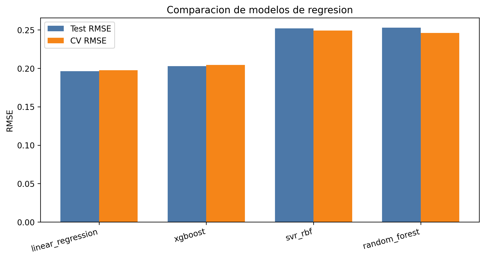

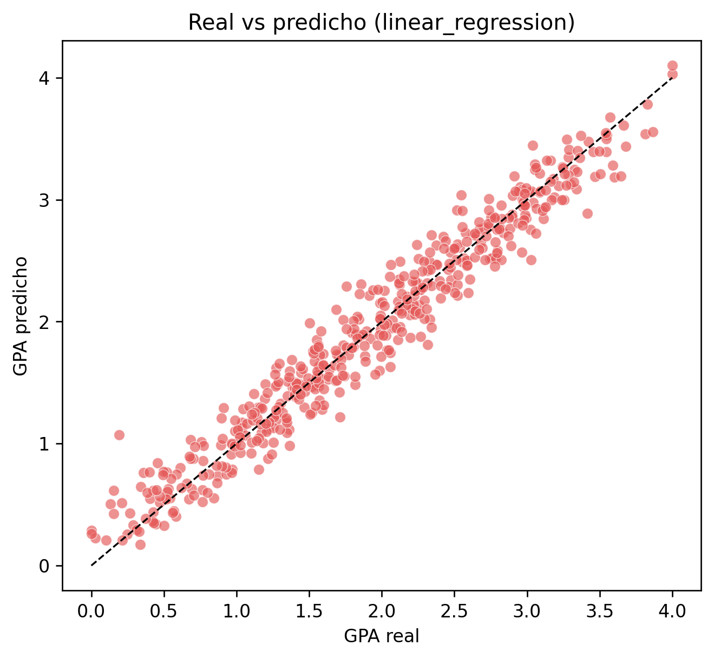

### 4.2 Analisis de XGBoost

| Modelo | Train RMSE | Test RMSE | Gap RMSE | Test R2 |
|---|---:|---:|---:|---:|
| LinearRegression | 0.1960 | 0.1963 | 0.0003 | 0.9534 |
| XGBoost | 0.1381 | 0.2117 | 0.0736 | 0.9458 |

`XGBoost` se ve cercano al modelo lineal porque sus predicciones estan muy correlacionadas (`0.9957`). Aun asi, su error baja mucho en entrenamiento y sube en prueba. La interpretacion es que tiene mayor capacidad para ajustar el train, pero no generaliza mejor en este dataset.

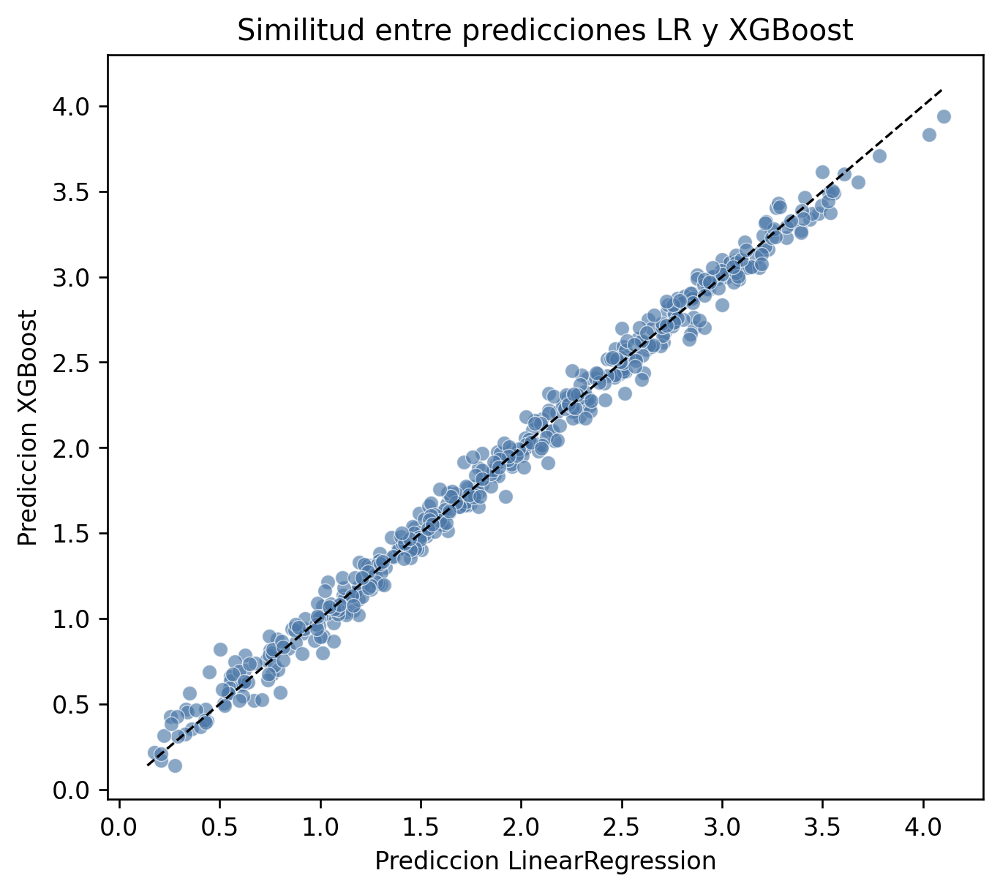

### 4.3 Importancia de variables y prueba sin Absences

Las variables mas importantes fueron:

| Variable | Importancia media |
|---|---:|
| Absences | 1.0056 |
| ParentalSupport | 0.1225 |
| StudyTimeWeekly | 0.1013 |
| Tutoring | 0.0519 |
| Sports | 0.0413 |

La correlacion entre `Absences` y `GPA` fue `-0.9193`.

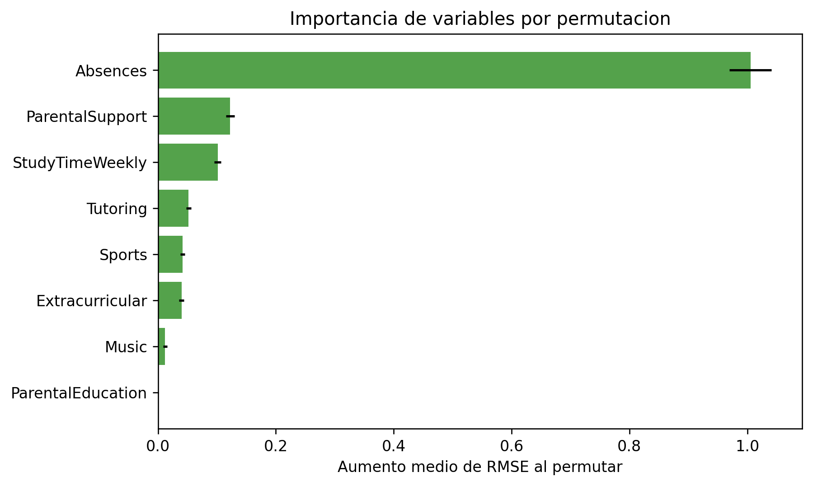

| Modelo | RMSE base | RMSE sin Absences | Delta RMSE | R2 sin Absences |
|---|---:|---:|---:|---:|
| LinearRegression | 0.1963 | 0.8692 | 0.6729 | 0.0864 |
| Random Forest | 0.2529 | 0.9278 | 0.6749 | -0.0411 |
| XGBoost | 0.2117 | 0.9398 | 0.7281 | -0.0681 |
| SVR RBF | 0.2520 | 1.0753 | 0.8233 | -0.3984 |

La caida de rendimiento confirma que `Absences` concentra la senal principal del dataset.

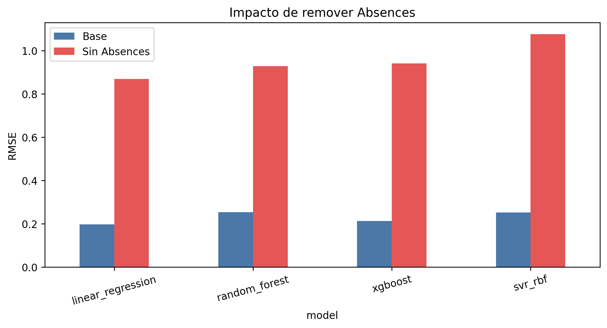

### 4.4 Clasificador de buen rendimiento

El mejor clasificador calibrado fue `logistic_regression_calibrated`.

| ROC AUC | Avg. Precision | Accuracy | Precision | Recall | F1 | Brier |
|---:|---:|---:|---:|---:|---:|---:|
| 0.9871 | 0.9704 | 0.9478 | 0.9143 | 0.9078 | 0.9110 | 0.0412 |

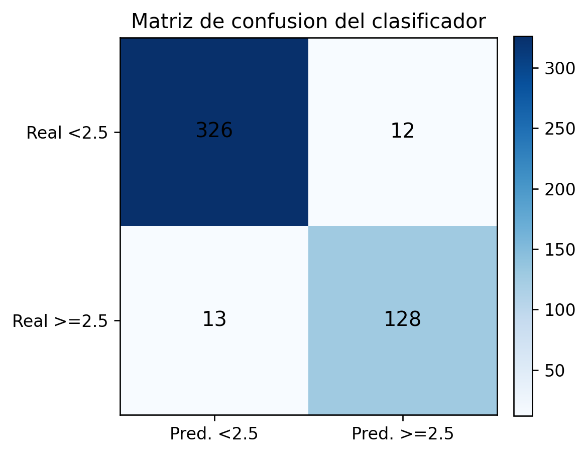

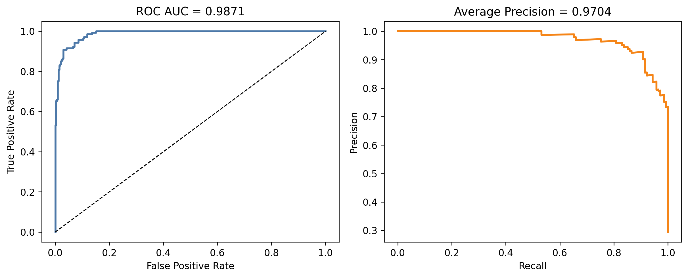

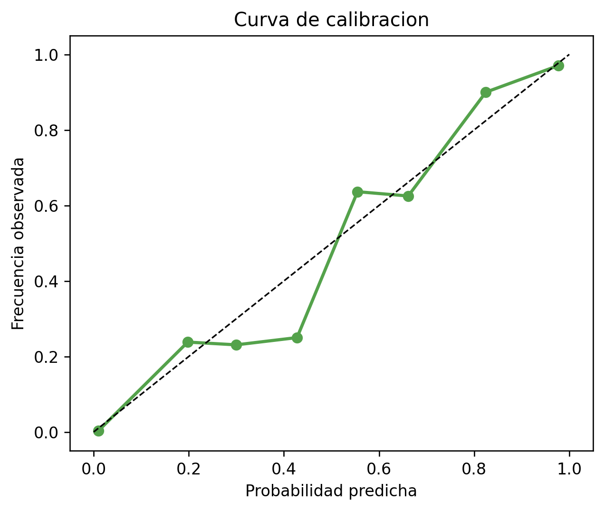

### 4.5 Recomendaciones para el estudiante

En un caso de alto riesgo, el mejor plan simulado fue:

```text
reducir ausencias a maximo 5
aumentar estudio hasta 20h/semana
activar tutoring
aumentar apoyo parental en 2
activar Extracurricular
```

Impacto estimado:

| GPA actual | GPA estimado | Prob. actual | Prob. estimada |
|---:|---:|---:|---:|
| 0.0000 | 3.6590 | 0.0% | 99.96% |

Este resultado es una simulacion, no una garantia causal.

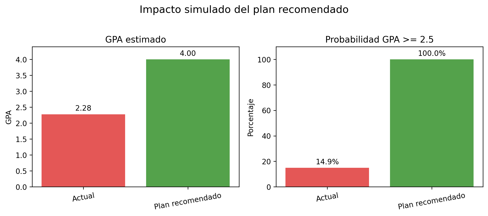

### 4.6 Auditoria basica de equidad

Aunque `Gender` y `Ethnicity` no se usan para recomendar acciones, se evaluaron metricas por grupo para detectar riesgos. La exactitud por `Gender` fue `0.9375` para el grupo 0 y `0.9582` para el grupo 1. Por `Ethnicity`, la exactitud oscilo entre `0.9130` y `0.9637`. Esto no prueba sesgo causal, pero justifica monitoreo de subgrupos antes de despliegue escolar.

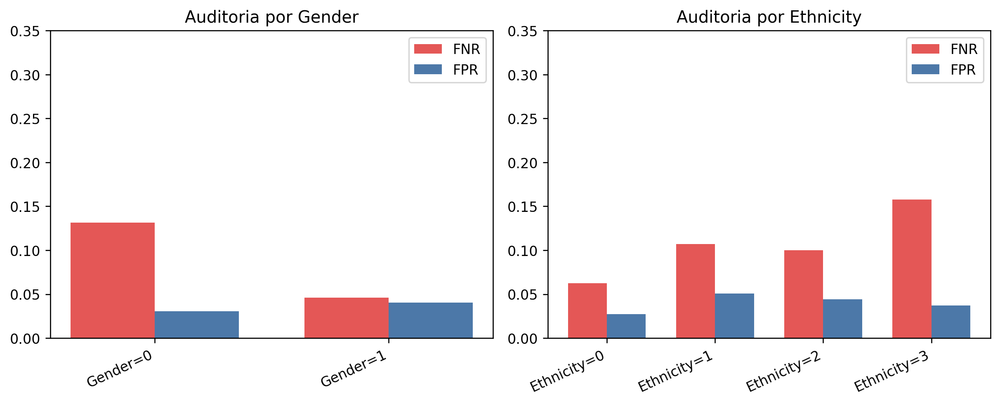

## 5. Discusion

El resultado central es que el modelo mas complejo no fue el mejor. `XGBoost` ajusto mejor el entrenamiento, pero no generalizo mejor que `LinearRegression`. La razon probable es que el dataset tiene una relacion dominante y casi lineal entre `Absences` y `GPA`.

La utilidad del proyecto esta en la capa de recomendacion. El sistema no solo predice, sino que simula escenarios y prioriza acciones. Esto lo acerca a una herramienta de alerta temprana para tutores y estudiantes.

## 6. Consideraciones eticas y limitaciones

El sistema no debe usarse para sancionar, excluir o etiquetar automaticamente estudiantes. Las recomendaciones son simulaciones del modelo, no evidencia causal. Antes de usarlo en una escuela real se necesita validacion local, supervision humana y auditoria periodica.

Limitaciones principales:

- La fuente exacta del dataset debe confirmarse antes de publicar formalmente.
- El dataset no es longitudinal.
- Las recomendaciones son contrafactuales simples.
- Faltan variables de contexto como salud, carga academica, nivel socioeconomico y calidad docente.
- El plan intensivo maximiza el resultado bajo reglas simuladas, pero su factibilidad real depende del estudiante y la escuela.

## 7. Conclusion

El proyecto demuestra que es posible construir un sistema interpretable para predecir GPA y recomendar intervenciones academicas. `LinearRegression` fue el mejor regresor, `Absences` fue la variable dominante y el clasificador calibrado permitio traducir cambios simulados en probabilidades de buen rendimiento.

El siguiente paso natural es convertir el notebook en una plataforma escolar demo con carga de CSV, ficha individual del estudiante, simulador de intervenciones, reporte para tutores y monitoreo etico de subgrupos.

## Referencias principales

- Rabie El Kharoua. *Students Performance Dataset*. Kaggle. https://www.kaggle.com/datasets/rabieelkharoua/students-performance-dataset
- Dalia Khairy et al. *Prediction of student exam performance using data mining classification algorithms*. Education and Information Technologies. https://link.springer.com/article/10.1007/s10639-024-12619-w
- Pedregosa et al. *Scikit-learn: Machine Learning in Python*. Journal of Machine Learning Research. https://www.jmlr.org/papers/v12/pedregosa11a.html
- Chen and Guestrin. *XGBoost: A Scalable Tree Boosting System*. https://arxiv.org/abs/1603.02754
